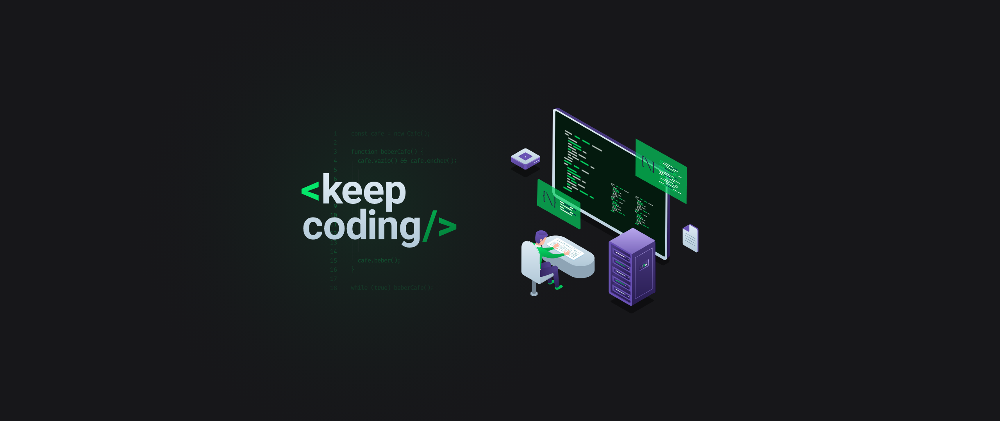
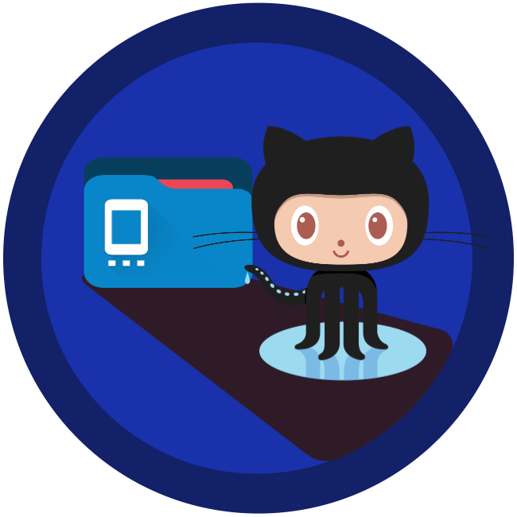

<h1 align="center"> <strong> Modulo 01 Bootcamp GoStack </strong> </h1>

<div align="center">
  </img>
</div>

<br />

<p align="center">Projeto Inicial <strong>Gerenciamento de Repositórios</strong> - Rocketseat</p>

<div align="center">
  </img>
</div>

<p align="center">
  <a aria-label="Versão do Node" href="#">
    </img>
  </a>

  <a aria-label="Versão do React Native" href="#">
    </img>
  </a>
    
  <a aria-label="Rocketseat" href="#">
    </img>
  </a>

  <a aria-label="License" href="#">
    </img>
  </a>
</p>

<p align="center">
  <a href="#rocket-tecnologias">Tecnologias</a>&nbsp;&nbsp;&nbsp;|&nbsp;&nbsp;&nbsp;
  <a href="#-projeto">Projeto</a>&nbsp;&nbsp;&nbsp;|&nbsp;&nbsp;&nbsp;
  <a href="#memo-licença">Licença</a>
</p>

## :rocket: Tecnologias

Este projeto desenvolvido no Bootcamp Goostack, e as tecnologias utilizadas foram:

- [Node.js](https://nodejs.org/en/)
- [React](https://reactjs.org)
- [React Native](https://facebook.github.io/react-native/)

## 💻 Projeto

Este projeto tem como intuito desenvolver uma aplicação mobilr que possibilita a gestão de repositórios do github de um usuário - em desenvolvimento Bootcamp GooStack - Rocketseat :rocket.

## Instalação
Para que o projeto funcione corretamente você deverá clonar o projeto em seu computador e configura-lo corretamente de acordo com os passo a passos a seguir.

### obs:
Lembre-se: **Verifique as portas que estão sendo utilizadas em seu computador, e caso seja necessário, configure as portas corretamente, para que não aja conflito entre seus projetos ou aplicações que já estejam em execução.**

### Dependências

##### Para Execução do -> Backend
Para instalar e executar o **Backend**, acesse a pasta backend com o seu terminal e em seguida execute:
```bash
yarn
yarn dev
```

##### Para Execução do ->  Mobile
Para executar a aplicação **Mobile**, primeiro configure o endereço do servidor no arquivo `src/services/api.js`, de acordo com o seus parâmetros de rede "seu `ip`", e a porta configurada no backend, para que a aplicação mobile consiga acessa a base de dados, em seguida abra o terminal dentro da pasta mobile e depois execute os comandos:
```
yarn
yarn start
```
Assim que o processo terminar, conecte seu emulador, caso não o possua instalado e queira utiliza-lo, use estes links, eles o ajudaram nesta tarefa, e explicarão sobre o funcionamento do emulador, [Rocketseat Docs Emulador Mobile](https://docs.rocketseat.dev/ambiente-react-native/android/emulador), [Emulando React Native no iOS/Android com Expo](https://www.youtube.com/watch?v=eSjFDWYkdxM).

Caso queira testa a aplicação mobile via `USB`: ative a função de desenvolvedor do seu dispositivo móvel, em seguida ative a função depurador, e depois conecte seu dispositivo movel no computador. Com isso configurado abra o terminal/prompt e execute o comando adb devices, o retorno deve ser algo como:

```
List of devices attached
14ed2fcc device # Dispositivo físico
```

Em seguida utilize os comandos do react-native-cli via npx em vez de uma instalação global para evitar possíveis erros.

```
npx react-native run-android
# Ou yarn run react-native run-android
# Ou yarn android
```

Caso tenha surgido algum erro e nao estaja conseguindo realizar esta tarefa, você pode acessar o seguinte link, [Rocketseat Docs Emulador Via USB](https://react-native.rocketseat.dev/usb/android), lá você terá a explicação mais detalhada, e imagens dos passo a passos caso tenha tido alguma dificuldade.

### obs:
Lembre-se: **Fique atento ao seu ip, sempre que executar a aplicação mobile, verifique se o ip `src/services/api.js` está correto, de acordo com o seu**.

## :memo: Licença

Esse projeto está sob a licença MIT. Veja o arquivo [LICENSE](LICENSE.md) para mais detalhes.